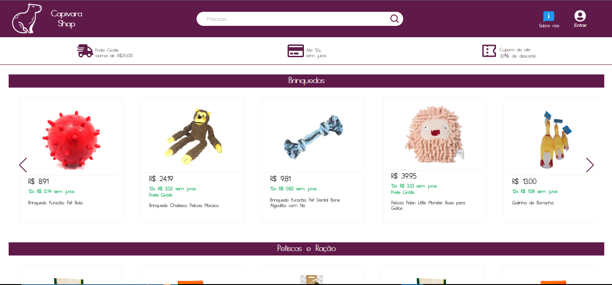

  <h1 align="center"> Capivara Shop</h1>


<p align="center">
    
</p>

___
Projeto realizado para o bootcamp da Blue EdTech, em parceria com a emrpesa Cloudwalk. O projeto é uma plataforma de e-commerce focada na parte de gerenciamento dos produtos.

____

## 👯‍♀️ Clonando

```bash
git clone https://github.com/CloudWalk-Team-B/gerenciador-CloudWalk-BTC-BLUE-Front.git
```

____

## 🔧 Instalação

Clone o repositorio e execute o comando abaixo para instalar as dependencias.

```sh
   yarn
```

____


## Para executar a aplicação
```sh
    yarn dev
```

##  🛠️ Construído com
- 
- 
- 
- 

____

## 🔨 Funcionalidades do projeto
<details>
 <summary><b>/</b></summary> 
</details>
<details>
 <summary><b>/login</b></summary> 
</details>
<details>
 <summary><b>/info</b></summary> 
</details>
<details>
 <summary><b>/produtos</b></summary> 
</details>
<details>
 <summary><b>/cadastro</b></summary> 
</details>
<details>
 <summary><b>/product</b></summary> 
</details>
<details>
 <summary><b>/usuario</b></summary> 
</details>
<details>
 <summary><b>/validate-user/:param</b></summary> 
</details>


____


## 🔗 Links auxiliares

- <a href="https://miro.com/app/board/uXjVPZk5rUk=/"></a>
- <a href=""></a>
 

 <details>
  <summary><b>Backend</b></summary> 

 <li><a href="https://github.com/CloudWalk-Team-B/gerenciador-CloudWalk-BTC-BLUE-Back/blob/main/README.md">Doc Backend</a></li>
 <li><a href="https://g-udrk.onrender.com/api/">Swagger</a></li>
</details>

____

## 🌎 Nosso time
<br/><br/>
<p>
    
    <p>&nbsp&nbsp&nbspJoão Pedro Thuler Lima<br>
    &nbsp&nbsp&nbsp<a href="https://github.com/thulerjoao">GitHub</a>&nbsp;|&nbsp;<a href="https://www.linkedin.com/in/thulerjoao/">LinkedIn</a>
</p>
<br/><br/>
<p>
    
    <p>&nbsp&nbsp&nbspMauricio Lope<br>
    &nbsp&nbsp&nbsp<a href="https://github.com/LopezJunior">GitHub</a>&nbsp;|&nbsp;<a href="https://www.linkedin.com/in/mauricio-lopes-264683206/">LinkedIn</a>
</p>
<br/><br/>
<p>
    
    <p>&nbsp&nbsp&nbspBruno De Lucca<br>
    &nbsp&nbsp&nbsp<a href="https://github.com/SuiCarrot">GitHub</a>&nbsp;|&nbsp;<a href="https://www.linkedin.com/in/bruno-de-lucca/">LinkedIn</a>
</p>
<br/><br/>
<p>
    
    <p>&nbsp&nbsp&nbspPedro Santos<br>
    &nbsp&nbsp&nbsp<a href="https://github.com/PedroSantoss-Dev">GitHub</a>&nbsp;|&nbsp;<a href="https://www.linkedin.com/in/pedro-santos-dev/">LinkedIn</a>
</p>
<br/><br/>

____

## 🎁 Expressões de gratidão

* Conte a outras pessoas sobre este projeto 📢
* Convide alguém da equipe para uma cerveja 🍺
* Obrigado publicamente 🤓.
* Dê uma nota alta pro trabalho.
* etc.
